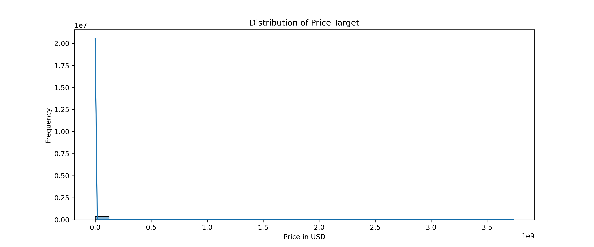
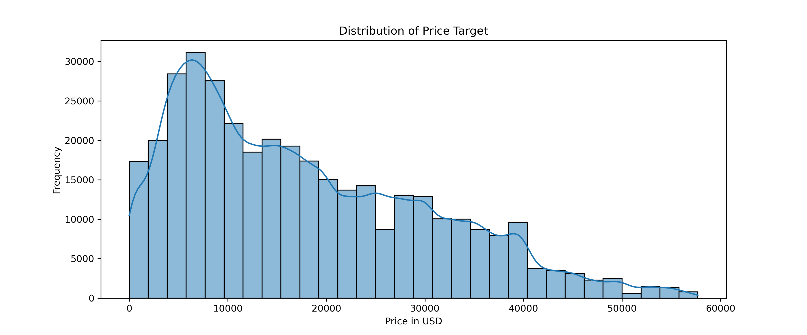
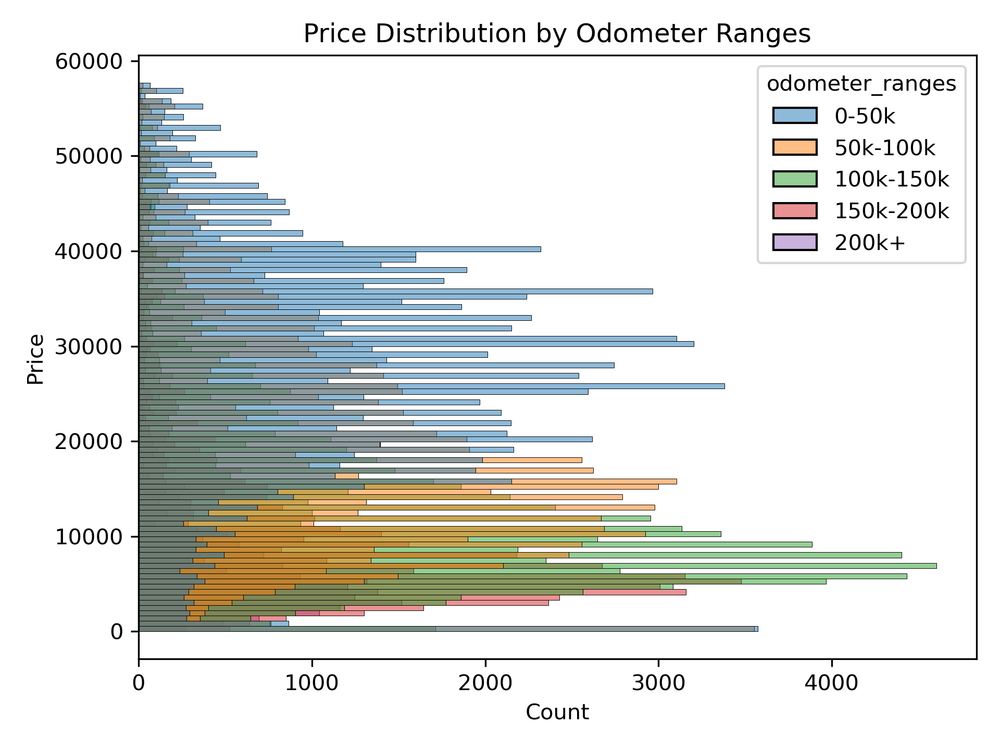
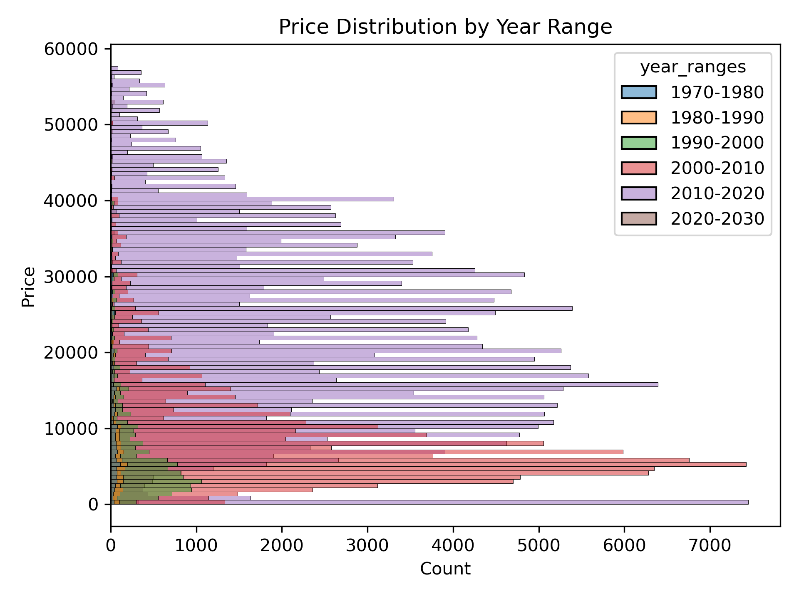
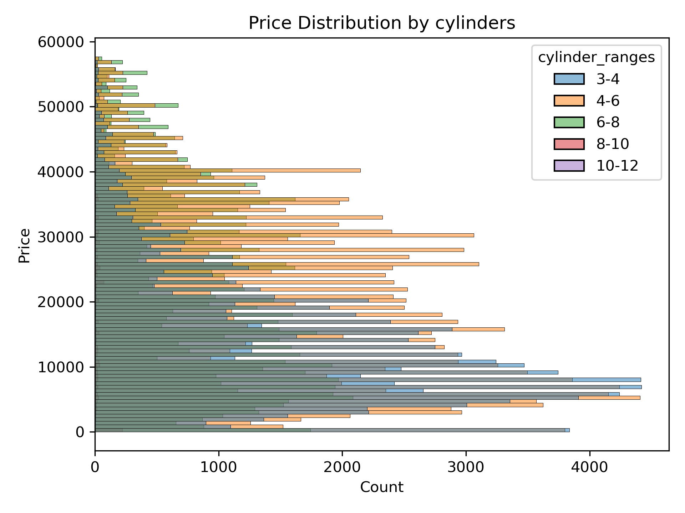
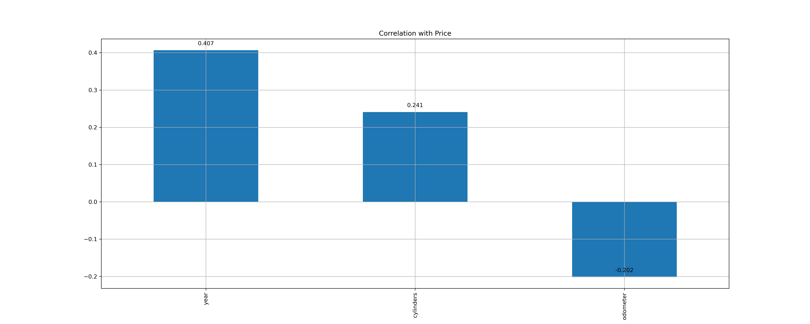
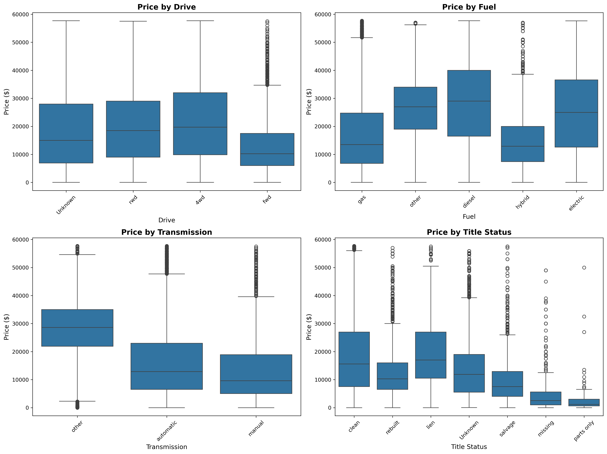
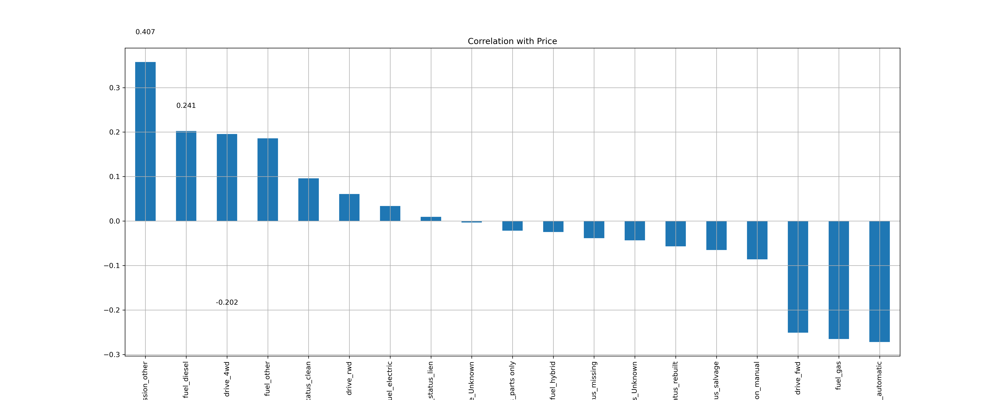
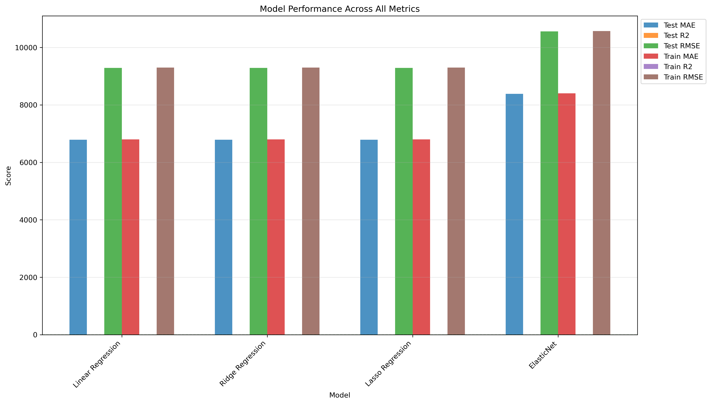

# Methodology 
 We will use CRISP-DM or Cross Industry Standard Process For Data Mining as the method of data analysis.

 

 CRISP DM contains the following steps 

 1. Understanding the Business
 2. Understanding the Data 
 3. Data Preparation
 4. Modeling 
 5. Evaluation 
 6. Deployment 

# Understanding the Business

As per this [forecast](https://www.mordorintelligence.com/industry-reports/united-states-used-car-market), the used car industry in the US is at a staggering 871 billion USD in 2026 and poised to grow to 980.47 billion USD by 2031. 

The key business objective is to understand and identify the important features in a used car that can help sales teams in car dealerships determine the types of used cars that should be kept in inventory to maximize sales. A used car dealership works on the principle that the vehicle they acquire should sell for a profit. Therefore, it's important to be able to predict the final sale price of a car based on its characteristics. 

This can help dealers make informed buying decisions and also determine the price of the used car they purchase for resale. While maximizing profit is one of the important goals, another factor is to identify market demand and purchase the right cars that can be easily resold.

**Target audience: Sales and acquisition teams in used car dealerships**

# Notebook
The jupyter notebook used for this machine learning exercise is present [here](prompt_II.ipynb) 

# Understanding the Data

## Dataset
The provided dataset is a pruned dataset from the original dataset from kaggle. While the original dataset contained millions of rows the current dataset contains **426880** rows and **18** columns.

The dataset contains 17 feature columns and 1 target column.

## Feature columns 

| Name   | Data Type  | Description                           |
|--------|------------|---------------------------------------|
| Id     | Integer    | A long integer identifier for a vehicle.|
| Region | Object     | A string representation of the region where the vehicle belongs to.|
| year   | Integer    | A string representation of the year of manufacture of the vehicle.|
| manufacturer   | Object    | The manifacturing entity of the vehicle.|
| model   | Object    | The model of the vehicle.|
| condition   | Object    | The current condition of the vehicle.|
| cylinders   | Object    | The number of cylinders in the vehicle.|
| fuel   | Object    | The fuel type used in the vehicle. eg: gas|
| odometer   | Float    | The current odometer reading of the vehicle in miles.|
| title_status   | Object    | What is the current title status of the vehicle? eg: clean|
| transmission   | Object    | The transmission type of the vehicle? eg: auto, manual|
| VIN   | Object    | The VIN identifier of the vehicle|
| drive   | Object    | The drive type of the vehicle eg: 4 wheel drive|
| size   | Object    | The size of the vehicle eg: full or mid size|
| type   | Object    | The type of the vehicle eg: sedan, SUV or pickup|
| paint_color   | Object    | The color of the vehicle eg: red, silver etc|
| state   | Object    | The 2 letter US state code where the vehicle is registered. eg:ca, al etc|

## Target column

The target column is **price**, and is an integer representation of the price of the vehicle in USD.

# Data Preparation

## Data Quality 

### Type correction

Some of the column types were modifed for easy handling

|Column       |  Source Type| Destination Type|
|-------------|-------------|-----------------|
| year        | float64     | int64           |
| odometer    | float64     | int64           |
| cylinders   | object      | int64           |

### Duplicate Rows
The dataset contains **0** duplicate rows 

### Missing values

|Column       |  Missing Value (Percentage)|
|-------------|----------------------------|
|year         |    0.282281                |
|manufacturer |    4.133714                |
|model        |    1.236179                |
|condition    |   40.785232                |
|cylinders    |   41.622470                |
|fuel         |    0.705819                |
|odometer     |    1.030735                |
|title_status |    1.930753                |
|transmission |    0.598763                |
|VIN          |   37.725356                |
|drive        |   30.586347                |
|size         |   71.767476                |
|type         |   21.752717                |
|paint_color  |   30.501078                |

> [!NOTE]
> **VIN is meaninless to the model and size has very large missing values(71.76%) which will render any imputation strategy meaningless. Hence both these columns will be dropped.**

> [!NOTE]
> **Other columns with large missing values are condition, paint_color,clylinders, type and drive but we will keep them**

The following imputation strategy was applied to handle missing values 

|Column       |  Imputation strategy       |
|-------------|----------------------------|
|year         | Impute with median         |
|manufacturer | Drop rows where missing    |
|model        | Drop rows where missing    |
|condition    | Create Unknown category    |
|cylinders    | hierarchical fallback with transformation and imputation with median |
|fuel         | Impute with mode           |
|odometer     | Impute with median         |
|title_status | Create Unknown category    |
|transmission | Impute with mode           |
|VIN          | Drop column                |
|drive        | Create Unknown category    |
|size         | Drop column                |
|type         | Create Unknown category    |
|paint_color  | Create Unknown category    |

> [!IMPORTANT]
> **Post imputation showed 0 missing values in all columns**
> Post imputation the dataset contains  **404026** rows and **16** columns

## Data Validation and further cleanup

1. All rows where price was zero were dropped.
2. All rows where odometer readings were zero were dropped as these are old cars.
3. Post further cleanup the dataset contains  **372269** rows and **16** columns

## Data Visualization

### Target Visualization

A histogram of the target showed a very right skew with the max value at 3.7 billion USD which is most likely an error. 

Outlier analysis was performed using the InterQuartileRange or IQR method and **6,899** outliers were
found and removed. Post outlier removal showed a more reasonable distribution of price.

## Feature Visualization

### Numeric features 

1. Odometer readings 

The plot below shows the relationship between vehicle price in USD and Odometer readings.

This shows an inverse relationship between Odometer readings and vehicle price. Higher the reading lower the price.

2. Year of manufacture 

The plot below shows the relationship between vehicle price in USD and year of manufacture.

This shows the age based depreciation of assets in a market. The market seems heavily skewed towards nearer vehicles. Vehicles manufactured before the year 2000 attract very little price and shows the general trend of vehicle depreciation beyond 10-15 years of the life of the vehicle.

3. Number of cylinders 

The plot below shows the relationship between vehicle price in USD and number of cylinders.

The plot shows that the market is dominated by the 4-6 cylinders category. It shows a strong corelation between number of cylinders and the price. However the possible luxury vehicles with more than 8 cylinders have a very small market share. 

**Correlation betwen price and numeric features**

| Feature  	   | correlation Score |correlation Indicator|    Note       |
|--------------|-----------------------|---------------|---------------|
| year.        | 0.407                 | Very Strong positive correlation| Higher the manufacturing year(newer the car) higher the price.|
| cylinders | 0.241 | Strong positive correlation| vehicles with more cylinders are generally luxury ones and command a higher price.|
| odometer| -0.2 | Strong negative correlation| As vehicles add more miles , they generally selll for less in the market|

### Categorical features

A combined box plot of several categorical features with price shows the following 

1. Drive Type
   - Four wheel drive (4wd) attracts the highest price. These are mostly SUVs or trucks.
   - Front wheel drive (fwd) is the most economic. These are mosly low end sedans.
2. Fuel Type 
   - Gas vehicles dominate the market.
   - Diesel prices attact a higher price. Probably again SUVs or trucks.
   - Most hybrid cars are in the affordable range , showing a low resell value.
   - Electic vechicles attract high prices too.
   

3. Tranmission Type 
   - Manual transmission vehicles are cheapest , most likely due to being older models.
   - Automatic transmission dominates.

4. Title Status type 
   - Clean and lien attract the highest price.
   - Its very hard to sell missing or salvaged vehicles in the secondary market as they attract a vey low valuation.

**Correlation betwen price and categorical features**

| Feature              | Correlation Score | Correlation Indicator           | Note                                                                                                          |
|----------------------|-------------------|---------------------------------|---------------------------------------------------------------------------------------------------------------|
| fuel_diesel          | 0.241             | Strong positive correlation     | Diesel vehicles (trucks, luxury sedans) command premium prices in the market.                                 |
| drive_4wd            | 0.197             | Moderate positive correlation   | Four-wheel drive vehicles (SUVs, trucks) are more valuable due to capability and demand.                      |
| fuel_other           | 0.187             | Moderate positive correlation   | Alternative fuel vehicles (hydrogen, E85, etc.) tend to be newer or specialty vehicles with higher prices.    |
| title_status_clean   | 0.097             | Weak positive correlation       | Clean title is essential for maintaining vehicle value; represents accident-free history.                     |
| drive_rwd            | 0.061             | Weak positive correlation       | Rear-wheel drive vehicles include performance and luxury cars, slightly increasing value.                     |
| fuel_electric        | 0.033             | Very weak positive correlation  | Electric vehicles show minimal positive correlation, likely due to wide range from budget to luxury EVs.      |
| transmission_manual  | -0.088            | Weak negative correlation       | Manual transmission vehicles are less desirable in the US market, reducing resale value.                      |
| drive_fwd            | -0.202            | Strong negative correlation     | Front-wheel drive is associated with economy/compact vehicles, resulting in lower average prices.             |
| fuel_gas             | -0.263            | Strong negative correlation     | Gasoline vehicles represent the baseline/economy segment; premium vehicles use alternative fuels.             |
| transmission_automatic| -0.273           | Strong negative correlation     | Automatic transmission being negative suggests premium vehicles have advanced transmissions (CVT, dual-clutch).|

# Modeling

We will perform modeling with the following classifiers

1. Linear Regression
2. Ridge Regression
3. Lasso Regression
4. ElasticNet

## Training/Testing data split 
1. Train test split or cross validation is used for reproducibility.
2. 20% of the dataset is used for the testing split.

## Column encoder pipelines 

1. Numerical columns are scaled with RobustScaler to handle outliers.
2. Categorical columns are encoded with OneHotEncoder.
3. Ordinal columns are encoded with OrdinalEncoder.

After training the pipeline and using it to predict values, several metrics of the models were captured.

| Model              | Train RMSE  | Test RMSE   | Train MAE  | Test MAE   | Train R²  | Test R²   |
|--------------------|-------------|-------------|------------|------------|-----------|-----------|
| Linear Regression  | 9300.411421 | 9289.784904 | 6798.421312| 6789.259621| 0.463361  | 0.463697  |
| Ridge Regression   | 9300.411494 | 9289.780646 | 6798.440979| 6789.277920| 0.463361  | 0.463697  |
| Lasso Regression   | 9300.948112 | 9289.931522 | 6799.030266| 6789.198471| 0.463299  | 0.463680  |
| ElasticNet         | 10573.409627| 10560.408524| 8402.815919| 8384.188618| 0.306402  | 0.306957  |

The comparative performance of the models is captured in the image below 

Post tuning using grid search CV, the following metrics were captured along with the parameters that led to them

| Model | Best Parameters | Train RMSE | Test RMSE | Train MAE | Test MAE | Train R² | Test R² |
|-------|----------------|------------|-----------|-----------|----------|----------|---------|
| Linear Regression | `fit_intercept: True` | 9,300.41 | 9,289.78 | 6,798.42 | 6,789.26 | 0.4634 | 0.4637 |
| Ridge Regression | `alpha: 10, solver: svd` | 9,300.42 | 9,289.75 | 6,798.62 | 6,789.44 | 0.4634 | 0.4637 |
| Lasso Regression | `alpha: 0.1, max_iter: 5000` | 9,300.42 | 9,289.75 | 6,798.45 | 6,789.22 | 0.4634 | 0.4637 |
| ElasticNet | `alpha: 0.1, l1_ratio: 0.7` | 9,448.89 | 9,431.78 | 6,987.65 | 6,972.48 | 0.4461 | 0.4472 |

### Key Findings:
- **Best Model**: Linear Regression 
- **Performance**: Linear, Ridge, and Lasso are nearly identical in performance.
- **Overfitting**: Minimal overfitting across all models (Train ≈ Test metrics)

> [!NOTE]
> **ElasticNet significantly underperforms other models.**
 

### Optimal Hyperparameters:
- **Ridge**: `alpha=10` provides optimal regularization
- **Lasso**: `alpha=0.1` with sufficient iterations (5000)
- **ElasticNet**: `alpha=0.1, l1_ratio=0.7` favors L1 regularization

## Coefficients from the model 

### Linear Regression

| Rank | Feature | Coefficient | Impact |
|------|---------|-------------|--------|
| 1 | fuel_gas | -8,715.71 | Decreases price |
| 2 | transmission_other | 7,848.28 | Increases price |
| 3 | fuel_hybrid | -7,823.92 | Decreases price |
| 4 | fuel_other | -7,341.68 | Decreases price |
| 5 | title_status_missing | 6,859.73 | Increases price |
| 6 | drive_fwd | -5,240.25 | Decreases price |
| 7 | title_status_lien | 5,019.40 | Increases price |
| 8 | year | 4,980.42 | Increases price |
| 9 | cylinders | 4,391.73 | Increases price |
| 10 | type_convertible | 4,379.10 | Increases price |

# Deployment

The following reccomendations can be made to sales representatives of used care dealers 

1. Front wheel cars fetch lower value.
2. Cars with more cylinders, or convertible types increase resale value.
3. Newer the manufacturing year or model, better the price.
4. Title status is very imporant for price determination. Please eensure necessary legal verification is done.
5. Gas powered vehicles have more selling potential over hybrid cars
6. Vehicles with automatic transmissions command higher prices over manual transmissions.

> [!IMPORTANT]
Aim for newer, clean(title), higher cylinder, gas vehicles with automatic transmission and right body types to maximize profit potential.
