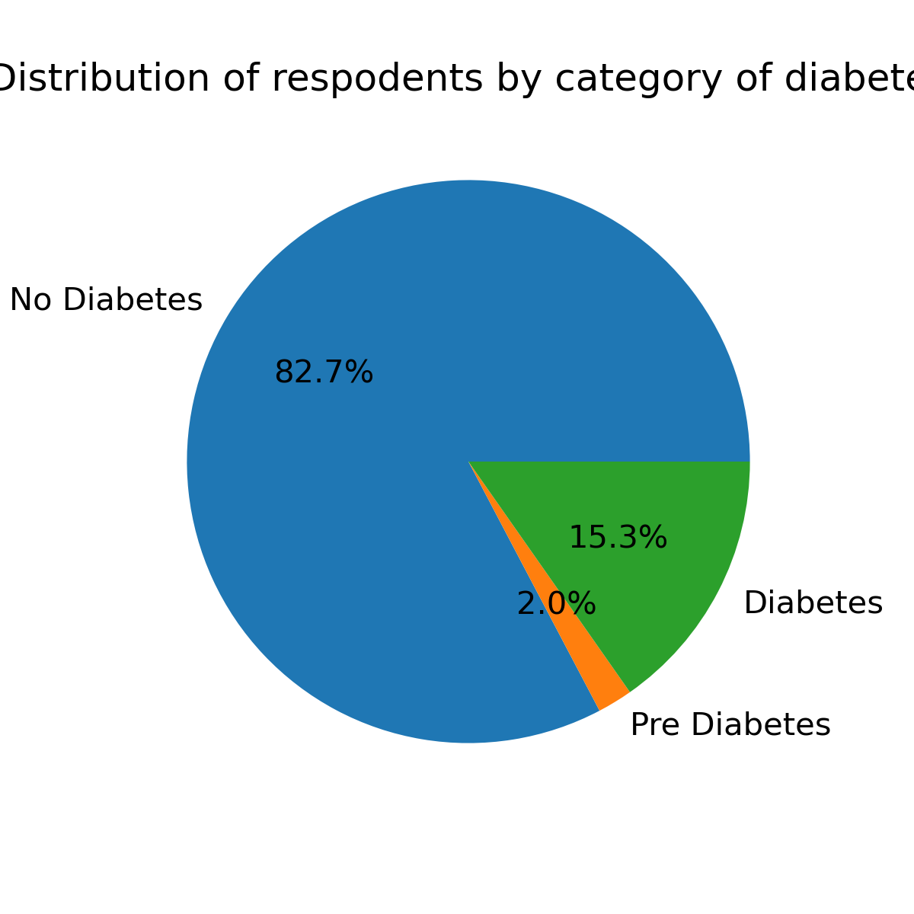
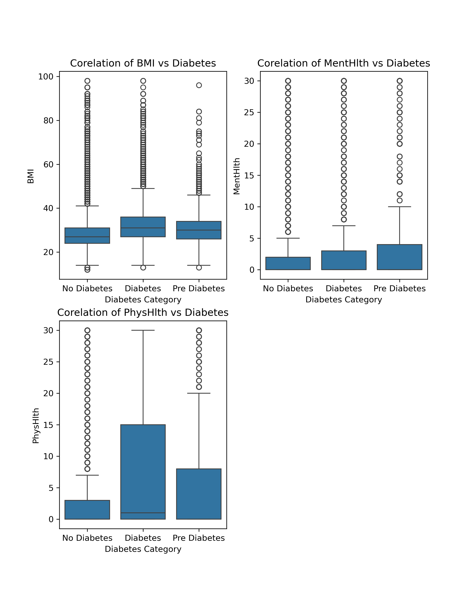
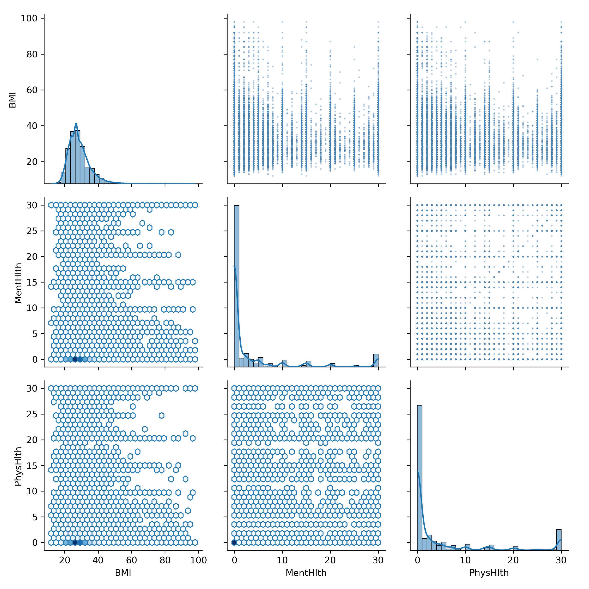
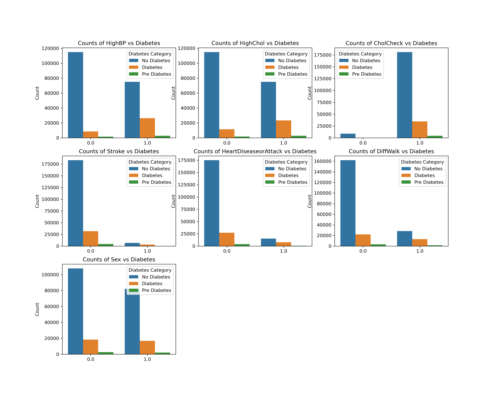
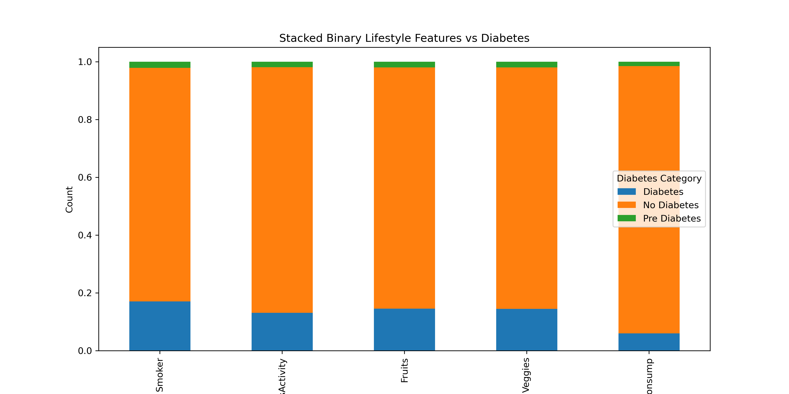

# Methodology 
 We will use CRISP-DM or cross Industry Standard Process for Data Mining as the method of data analysis.

 

 CRISP DM contains the following steps 

 1. Understanding the Business
 2. Understanding the Data 
 3. Data Preparation
 4. Modeling 
 5. Evaluation 
 6. Deployment 

## Research Question
**Which lifestyle factors such as diet exercise etc can be used to predict the 
risk of diabetes?**

# Understanding the Business

This research can help address a significant public health problem. If it can be shown that lifestyle factors (which can be modified) have a significant contribution in predicting risk of diabetes, then public health programs can be targeted towards certain empowering people to control diabetes through lifestyle changes.

As per https://www.cdc.gov/diabetes/php/data-research/index.html 40.1 million people(12% of the population) are diabetic. Since a very large population of 115.2 million are pre-diabetic , targeted intervention can help contain this risk. This will could reduce the burden of this disease on Americans.

# Understanding the Data

The dataset contains **253680** rows and  **22** columns. The dataset contains 21 feature columns and 1 target column.

## Feature columns 

| Name  	                    | Data Type            | Indicator Type| Description                                  |
|----------------------------|----------------------|---------------|-----------------------------------------------|
| HighBP                     | Categorical(Binary)  | Clinical |Does the respodent have high blood pressure?                 |
| HighChol                   | Categorical(Binary)  | Clinical |Does the respodent have high cholestrol?                     |
| CholCheck                  | Categorical(Binary)  | Clinical |Has the respodent done a cholestrol check in past 5 years?   |
| BMI                        | Numeric (Float)      | Lifestyle| Body mass Index of the respodent                             |
| Smoker                     | Categorical(Binary)  | Lifestyle|Has the respodent smoked atleast 100 cigs in his entire life?|
| Stroke                     | Categorical(Binary)  | Clinical |Was the respodent ever told that he had a stroke?            |
| HeartDiseaseorAttack       | Categorical(Binary)  | Clinical |Does the respodent have coronary heart disease?              |
| PhysActivity               | Categorical(Binary)  | Lifestyle| Did the respodent do any physical activity in past 30 days?  |
| Fruits                     | Categorical(Binary)  | Lifestyle|Does the respodent consume fruits one or more times daily?   |
| Veggies                    | Categorical(Binary)  | Lifestyle|Does the respodent consume veggies one or more times daily?  |
| HvyAlcoholConsump          | Categorical(Binary)  | Lifestyle|Is the respodent a heavy drinker(14 drinks/week for men and 7 drinks/week for women 0 is heavy and 1 is not heavy)                 |
| AnyHealthcare              | Categorical(Binary)  | Lifestyle|Does the respodent have healthcare coverage?                 |
| NoDocbcCost                | Categorical(Binary)  | Lifestyle|Did the respodent not visit a doctor in the past 12 months due to cost?      |
| GenHlth                    | Categorical(Ordinal) | Lifestyle|Respodent rating on a scale of 1-5 on general health         |
| MentHlth                   | Numeric              | Lifestyle|Number of days during past 30 days when respodent encountered stress, depression or any other mental health challenges.              |
| PhysHlth                   | Numeric              | Lifestyle|Number of days during past 30 days when respodent encountered injuries or other physical health challenges.              |
| DiffWalk                   | Categorical(Binary)  | Clinical|Does the respodent have difficulty walking or climbing stairs?               |
| Sex                        | Categorical(Binary)  | Clinical|Gender of the respodent (Male or Female)                 |
| Age                        | Categorical(Ordinal) | Clinical|Age level of the respodent based on a 13-level age category(_AGEG5YR)  1 = 18-24 9 = 60-64 13 = 80 or older                 |
| Education                  | Categorical(Ordinal) | Lifestyle|Education level (EDUCA) of the respodent           |
| Income                     | Categorical(Ordinal) | Lifestyle|Income level (INCOME2 )  of the respodent              |

## Target column

The target column is 'Diabetes_012' which contains values representing the following 
1. 0 means no diabetes. 
2. 1 means pre-diabetes.
3. 2 means diabetes. 

# Data Preparation

## Data Quality 

### Missing values 
The dataset contains no missing or null values (NAN, None or NAT) values

> [!NOTE]
> **Since no missing values are found, imputing with median or mean for numeric features is not required. Similarly no handling is required for the categorical features.**

### Duplicate Rows
The dataset contains **23899** duplicate rows 

After clean-up of the duplicate rows, we are left with **229781** rows.

### Categorical data validation
All categorical columns contain data with right cardinality as defined.

### Data Visualization

A pie plot of the target column shows the following distribution

| Type  	                    | Count                |    Percentage       |
|----------------------------|----------------------|---------------------|
| No Diabetes                | 190055               |  82.7%              |
| Pre Diabetes               | 4629                 |  2.0%               |
| Diabetes                   | 35097                |  15.3%              |

Histograms of all features can be shown in the following image 

#### Numeric Features
A box plot of the numeric features was created to show the co-relation between the features and the target.

The plot shows the following 

1. Correlation of Body Mass Index(BMI) to diabetes 
   - Respodents with "Pre Diabetes" or "Diabetes" have a high BMI
   - As median BMI increases, the risk of falling into "Pre Diabetes" or "Diabetes" increases
> [!NOTE]
> **High BMI has a strong correlation with the risk of diabetes.**

2. Correlation of mental health to diabetes 
   - Respodents with median days with mental health conditions is close to negligible(almost 0) for all categories
   - Some outliers exist with many people reporting a lot of days when mental health conditions persisted.
> [!NOTE]
> **Mental health does not seem to impact different diabetic categories differently.**

2. Correlation of physical health to diabetes 
   - Respodents with median days of physical health conditions increases in the "Diabetes" category
   - Some outliers exist.
> [!NOTE]
> **Poor physical health shows a weak correlation with the risk of diabetes.**

A Violin plot of the numeric features was created to show correlation between the features and the target.

The violin plot  shows that BMI is more differentiated across different diabetic categories. Mental health and Physical health are skewed towards 0 and the differences are hard to visualize(proving the weak or no correlation).

A pair wise grid plot of the numeric features is shown here 

1. BMI vs Mental Health: Most data concentrated at MentHlth =0 across all BMIs. Higher BMI seems slighlty more associated with mental health issues.
2. BMI vs Physical Health: Positive correlation is visible. Higher BMI seems to associate with greater physical health issues.
3. Mental Health vs Physical Health: A stronger grid pattern is observed here. Positive correlation is observed signalling this respodents with poor physical health also have poor mental health. 

##### IQR Analysis
| Feature  	                    | IQR                |    Outlier Percentage|
|----------------------------|-----------------------|---------------------|
| BMI		                    | 8.0                   |  2%                 |
| MentHlth		              | 2.0                   |  15.7%              |
| PhysHlth		              | 4.0                   |  14.9%              |

> [!NOTE]
> **IQR analysis and visual analysis of the box plots show that almost 15% of the respodents experienced 
> worse mental or physical health conditions than the rest of the respodents. However outliers identified here
> should not be removed as they would remove the people identified with chronic conditions, depression and 
> very high BMI and skew the data towards healthy people.**

#### Binary Categorical Clinical Features 

A stacked bar chart of the Clinical Categorical Binary features showed the following 

A count plot of the Clinical Categorical Binary features showed the following 

A bar plot of correlation scores of the Clinical Categorical Binary features showed the following

 **Correlation of Clinical Features with risk of diabetes**

| Feature  	   | correlation Score |correlation Indicator|    Note       |
|--------------|-----------------------|---------------|---------------|
| HighBP       |0.254 |Strong Indicator      |Diabetes is more prevalent when high blood pressure is diagnosed. (HighBP=1)|
| HighChol     |0.195 |Strong Indicator      |Diabetes is more prevalent when high cholestrol is diagnosed. (HighChol=1)|
| CholCheck    |0.072| Weak Indicator |Almost everyone had done a cholestrol check in the past 5 years|
| Stroke       |0.099 |Moderate  Indicator   |Low percentage of respodents had a stroke, but within those who had diabetics was a significant number|
| HeartDiseaseorAttack |0.168|Moderate Indicator| More respodents with diabetes have heart disease.|
| DiffWalk |0.206 |Strong Indicator| Respodents who face dificulty walking are more likely to have diabetes.|
| Sex |0.033  |Weak Indicator | Counts are balanced betwen the two genders|

#### Binary Categorical Lifestyle Features 

A stacked bar chart of the Lifestyle Categorical Binary features showed the following 

A count plot of the Lifestyle Categorical Binary features showed the following 

A bar plot of correlation scores of the Lifestyle Categorical Binary features showed the following

**Correlation of Lifestyle Features with risk of diabetes**

| Feature  	   | correlation Score |correlation Indicator|    Note       |
|--------------|-----------------------|---------------|---------------|
| Smoker       |0.046 |Weak Indicator      |Smokers have a slightly higher chance of diabetes|
| PhysActivity     |-0.101  |Strong Indicator      |People doing physical activity have lower risk of diabetes|
| HvyAlcoholConsump    |-0.066 | Moderate Indicator |Heavy consumption of alcohol increase risk of diabetes|
| Veggies       |-0.042  |Weak  Indicator   |Daily Veggie consumption slightly reduces risk of diabetes|
| Fruits       |-0.025  |Weak  Indicator   |Daily fruit consumption slightly reduces risk of diabetes|

#### Categorical Ordinal Features 

The ordinal features have the following characteristics 
| Feature  	   | Cardinality|
|--------------|------------|
|Education     | 6 [Educa USA](https://www.mtusdata.org/mtus-action/variables/EDUCA#codes_section)|
|Income        | 8 [INCOME2](https://www.icpsr.umich.edu/web/RCMD/studies/34085/datasets/0001/variables/INCOME2?archive=RCMD)          |
|Age           | 13 [_AGEG5YR](https://www.cdc.gov/brfss/annual_data/2020/pdf/2020-calculated-variables-version4-508.pdf)         |
|GenHealth     | 5          |

A combined line plot of the Lifestyle Categorical Ordinal features showed the following 

1. Education: There is an inverse relationship between the prevalnce of diabetes and education. As education levels increase, diabetes level decreases.This is probably due to the fact that education has a protective effect through increased awareness of the bad effects of diabetes on general health.

2. Income: Income also has an inverse relationship with prevalnce of diabetes. As income levels incease, socio economic factors and lifestyle contribute towards a lower prevalence.

3. Age: Prevalence of diabetes peaks in middle to late age group. This data matches with general occurence of type 2 diabetes in middle age or older age groups.

4. GenHealth: The health score goes from 1 being excellent and 5 being poor. The line plot clearly shows that as the health score increases, the prevalence of diabetes also increases from 3% to almost 38%

# Modeling 

## Baseline Feature selection
Since baseline models are meant to establish a benchmark, we will not drop any features.
We will combine all the features for the initial analysis with the baseline model.

We have also identified that

1. All binary features have 0 or 1 as the values 
2. All ordinal features are valid in range 

### Column Transformer

we will create a column transformation pipeline with the following steps 

1. RobustScaler for the numerical features.
2. Pass through on the categorical features. (binary and ordinal)

> [!NOTE]
> Since this is health data and we want to preserve the  outliers , we will apply a RobustScaler on the numerical features.

## Baseline Model

Choice Of Model: We will create our baseline with a **Logistic Regression** model for simplicity and easy interpretation

## Model scores 

| Metric  	                 | Score              | Intepretation |
|----------------------------|--------------------|----------------|
| Accuracy                   |  0.851             | 85.1% of the respodents were classified correctly by the model|
| Precision                  |  0.544             | When a model predicts that a respodent has diabetes its right 54.4% of the time| 
| Recall                     |  0.152             | Of all diabetic respodents only 15.2% are identified by the model|
| F1                         |  0.238             | Low recall with moderate precision|
| ROC-AUC                    |  0.811             | Probability that a randomly chosen diabetic respodent is ranked higher in predicted probablity than a randomly chosen non diabetic.|

# Inference 

> [!NOTE]
> **As seen from the distribution Pie chart, the total occurence of diabetes is only 15.3% of the overall
> dataset. The baseline model achieves an accuracy of 85.1% . Since the data is highly imbalanced accuracy cannot be used as a metric.**

> [!NOTE]
> **As seen from the distribution Pie chart, the total occurence of diabetes is only 15.3% of the overall
> dataset. Since the model is precise about half of the time, it shows low precision. In healthcare settings 
> false positives are unacceptable.**

> [!NOTE]
> **Recall is also very low at 15.2% ,again due to imblanced class problem. In the field of healthcare, correctly identifying positive cases is way more important than actual accuracy.**

> [!NOTE]
> **F1 score is also very low at 0.238. This shows that the baseline model performs poorly in 
> balancing false positive and false negatives.** 

> [!NOTE]
> **ROC-AUC is at 0.811. This shows that the baseline model performs reasonably well in 
> ranking diabetics higher than non diabetics and has high discriminative ability.**

# Next Steps 

1. Instead of using all features (as in the baseline), we should use interaction and cumulative features to 
   increase recall and F1 

2. Since the baseline model has a low recall , we should try the following models 

   - Tree based models eg: Decision Tree or Random Forest classifiers
   - SVM with RBF Kernel 
   - Ensemble models such as VotingClassifiers

