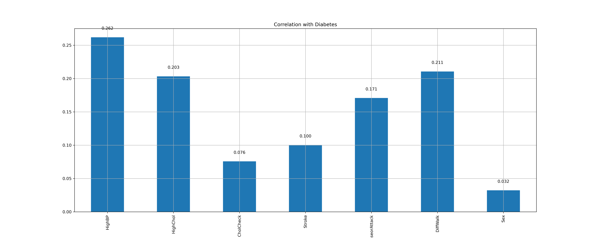
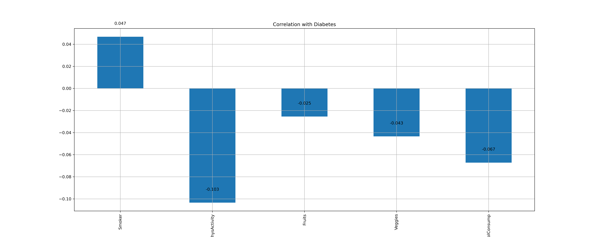

# Methodology 
 We will use CRISP-DM or cross Industry Standard Process for Data Mining as the method of data analysis.

 

 CRISP DM contains the following steps 

 1. Understanding the Business
 2. Understanding the Data 
 3. Data Preparation
 4. Modeling 
 5. Evaluation 
 6. Deployment 

## Research Question
**Which lifestyle factors such as diet exercise etc can be used to predict the 
risk of diabetes?**

# Understanding the Business

This research can help address a significant public health problem. If it can be shown that lifestyle factors (which can be modified) have a significant contribution in predicting risk of diabetes, then public health programs can be targeted towards certain empowering people to control diabetes through lifestyle changes.

As per https://www.cdc.gov/diabetes/php/data-research/index.html 40.1 million people(12% of the population) are diabetic. Since a very large population of 115.2 million are pre-diabetic , targeted intervention can help contain this risk. This will could reduce the burden of this disease on Americans.

# Understanding the Data

The dataset contains 253680 rows and  22 columns. The dataset contains 21 feature columns and 1 target column.

## Feature columns 

| Name  	                    | Data Type            | Indicator Type| Description                                  |
|----------------------------|----------------------|---------------|-----------------------------------------------|
| HighBP                     | Categorical(Binary)  | Clinical |Does the respodent have high blood pressure?                 |
| HighChol                   | Categorical(Binary)  | Clinical |Does the respodent have high cholestrol?                     |
| CholCheck                  | Categorical(Binary)  | Clinical |Has the respodent done a cholestrol check in past 5 years?   |
| BMI                        | Numeric (Float)      | Lifestyle| Body mass Index of the respodent                             |
| Smoker                     | Categorical(Binary)  | Lifestyle|Has the respodent smoked atleast 100 cigs in his entire life?|
| Stroke                     | Categorical(Binary)  | Clinical |Was the respodent ever told that he had a stroke?            |
| HeartDiseaseorAttack       | Categorical(Binary)  | Clinical |Does the respodent have coronary heart disease?              |
| PhysActivity               | Categorical(Binary)  | Lifestyle| Did the respodent do any physical activity in past 30 days?  |
| Fruits                     | Categorical(Binary)  | Lifestyle|Does the respodent consume fruits one or more times daily?   |
| Veggies                    | Categorical(Binary)  | Lifestyle|Does the respodent consume veggies one or more times daily?  |
| HvyAlcoholConsump          | Categorical(Binary)  | Lifestyle|Is the respodent a heavy drinker(14 drinks/week for men and 7 drinks/week for women)                 |
| AnyHealthcare              | Categorical(Binary)  | Lifestyle|Does the respodent have healthcare coverage?                 |
| NoDocbcCost                | Categorical(Binary)  | Lifestyle|Did the respodent not visit a doctor in the past 12 months due to cost?      |
| GenHlth                    | Categorical(Ordinal) | Lifestyle|Respodent rating on a scale of 1-5 on general health         |
| MentHlth                   | Numeric              | Lifestyle|Number of days during past 30 days when respodent encountered stress, depression or any other mental health challenges.              |
| PhysHlth                   | Numeric              | Lifestyle|Number of days during past 30 days when respodent encountered injuries or other physical health challenges.              |
| DiffWalk                   | Categorical(Binary)  | Clinical|Does the respodent have difficulty walking or climbing stairs?               |
| Sex                        | Categorical(Binary)  | Clinical|Gender of the respodent (Male or Female)                 |
| Age                        | Categorical(Ordinal) | Clinical|Age level of the respodent based on a 13-level age category(_AGEG5YR)  1 = 18-24 9 = 60-64 13 = 80 or older                 |
| Education                  | Categorical(Ordinal) | Lifestyle|Education level (EDUCA) of the respodent           |
| Income                     | Categorical(Ordinal) | Lifestyle|Income level (INCOME2 )  of the respodent              |

## Target column

The target column is 'Diabetes_012' which contains values representing the following 
1. 0 means no diabetes. 
2. 1 means pre-diabetes.
3. 2 means diabetes. 

# Data Preparation

## Data Quality 

### Missing values 
The dataset contains no missing or null values (NAN, None or NAT) values

> [!NOTE]
> Since no missing values are found, imputing with median or mean for numeric features is not required. Similarly no handling is required for the categorical features.

### Duplicate Rows
The dataset contains **23899** duplicate rows 

After clean-up of the duplicate rows, we are left with 229781 rows.

### Data Visualization

A pie plot of the target column shows the following distribution

| Type  	                    | Count                |    Percentage       |
|----------------------------|----------------------|---------------------|
| No Diabetes                | 190055               |  82.7%              |
| Pre Diabetes               | 4629                 |  2.0%               |
| Diabetes                   | 35097                |  15.3%              |

#### Numeric Features
A box plot of the numeric features was created to show the co-relation between the features and the target.

The plot shows the following 

1. Corelation of Body Mass Index(BMI) to diabetes 
   - Respodents with "Pre Diabetes" or "Diabetes" have a high BMI
   - As median BMI increases, the risk of falling into "Pre Diabetes" or "Diabetes" increases
> [!NOTE]
> High BMI has a strong corelation with the risk of diabetes.

2. Corelation of mental health to diabetes 
   - Respodents with median days with mental health conditions is close to negligible(almost 0) for all categories
   - Some outliers exist with many people reporting a lot of days when mental health conditions persisted.
> [!NOTE]
> Mental health does not seem to impact different diabetic categories differently.

2. Corelation of physical health to diabetes 
   - Respodents with median days of physical health conditions increases in the "Diabetes" category
   - Some outliers exist.
> [!NOTE]
> Poor physical health shows a weak corelation with the risk of diabetes.

A Violin plot of the numeric features was created to show corelation between the features and the target.

The violin plot  shows that BMI is more differentiated across different diabetic categories. Mental health and Physical health are skewed towards 0 and the differences are hard to visualize(proving the weak or no corelation).

#### Binary Categorical Clinical Features 

A stacked bar chart of the Clinical Categorical Binary features showed the following 

A count plot of the Clinical Categorical Binary features showed the following 

A bar plot of corelation scores of the Clinical Categorical Binary features showed the following

 

| Feature  	   | Corelation Score |Corelation Indicator|    Note       |
|--------------|-----------------------|---------------|---------------|
| HighBP       |0.26 |Strong Indicator      |Diabetes is more prevalent when high blood pressure is diagnosed. (HighBP=1)|
| HighChol     |0.20 |Strong Indicator      |Diabetes is more prevalent when high cholestrol is diagnosed. (HighChol=1)|
| CholCheck    |0.075| Weak Indicator |ALmost everyone had done a cholestrol check in the past 5 years|
| Stroke       |0.10 |Moderate  Indicator   |Low percentage of respodents had a stroke, but within those who had diabetics was a significant number|
| HeartDiseaseorAttack |0.17|Moderate Indicator| More respodents with diabetes have heart diesease.|
| DiffWalk |0.21 |Strong Indicator| Respodents who face dificulty walking are more likely to have diabetes.|
| Sex |0.03  |Weak Indicator | Counts are balanced betwen the two genders|

#### Binary Categorical Lifestyle Features 

A stacked bar chart of the Lifestyle Categorical Binary features showed the following 

A count plot of the Lifestyle Categorical Binary features showed the following 

A bar plot of corelation scores of the Lifestyle Categorical Binary features showed the following

| Feature  	   | Corelation Score |Corelation Indicator|    Note       |
|--------------|-----------------------|---------------|---------------|
| Smoker       |0.047 |Weak Indicator      |Smokers have a slightly higher chance of diabetes|
| PhysActivity     |-0.103  |Strong Indicator      |People doing physical activity have lower risk of diabetes|
| NoDocbcCost    |-0.067 | Moderate Indicator |This is a socio economic lifestyle indicator|
| Veggies       |-0.043  |Weak  Indicator   |Daily Veggie consumption slightly reduces risk of diabetes|
| Veggies       |-0.025  |Weak  Indicator   |Daily fruit consumption slightly reduces risk of diabetes|

# Modeling 

## Baseline Model

