# Methodology 
 We will use CRISP-DM or Cross Industry Standard Process For Data Mining as the method of data analysis.

 

 CRISP DM contains the following steps 

 1. Understanding the Business
 2. Understanding the Data 
 3. Data Preparation
 4. Modeling 
 5. Evaluation 
 6. Deployment 

## Research Question
**Which lifestyle factors such as diet exercise etc can be used to predict the 
risk of diabetes?**

# Notebook
1. The jupyter notebook used for this exploratory data analysis is present [here](capstone-eda.ipynb) 
2. The jupyter notebook used for model training and tuning is [here](diabetes_models.ipynb) 

# Understanding the Business

This research can help address a significant public health problem. If it can be shown that lifestyle factors (which can be modified) have a significant contribution in predicting risk of diabetes, then public health programs can be targeted towards certain empowering people to control diabetes through lifestyle changes.

As per https://www.cdc.gov/diabetes/php/data-research/index.html 40.1 million people(12% of the population) are diabetic. Since a very large population of 115.2 million are pre-diabetic , targeted intervention can help contain this risk. This will could reduce the burden of this disease on Americans.

**Public health officials, Researchers and general population could be the target audience of this analysis.**

# Understanding the Data

## Dataset

The dataset used here is the [CDC Diabetes Health Indicators](https://archive.ics.uci.edu/dataset/891/cdc+diabetes+health+indicators) dataset from UC Irvine Machine Learning Repository. The UC Irvine Machine Learning Repository points to the [Dataset Home Page](https://www.kaggle.com/datasets/alexteboul/diabetes-health-indicators-dataset) from kaggle. The raw data comes from the Behavioral Risk Factor Surveilance System from CDC. We will use the CSV from kaggle to perform the exploratory data analysis

The dataset contains **253680** rows and  **22** columns. The dataset contains 21 feature columns and 1 target column.

## Feature columns 

| Name  	                    | Data Type            | Indicator Type| Description                                  |
|----------------------------|----------------------|---------------|-----------------------------------------------|
| HighBP                     | Categorical(Binary)  | Clinical |Does the respondent have high blood pressure?                 |
| HighChol                   | Categorical(Binary)  | Clinical |Does the respondent have high cholestrol?                     |
| CholCheck                  | Categorical(Binary)  | Clinical |Has the respondent done a cholestrol check in past 5 years?   |
| BMI                        | Numeric (Float)      | Lifestyle| Body mass Index of the respodent                             |
| Smoker                     | Categorical(Binary)  | Lifestyle|Has the respondent smoked atleast 100 cigs in his entire life?|
| Stroke                     | Categorical(Binary)  | Clinical |Was the respondent ever told that he had a stroke?            |
| HeartDiseaseorAttack       | Categorical(Binary)  | Clinical |Does the respondent have coronary heart disease?              |
| PhysActivity               | Categorical(Binary)  | Lifestyle| Did the respondent do any physical activity in past 30 days?  |
| Fruits                     | Categorical(Binary)  | Lifestyle|Does the respondent consume fruits one or more times daily?   |
| Veggies                    | Categorical(Binary)  | Lifestyle|Does the respondent consume veggies one or more times daily?  |
| HvyAlcoholConsump          | Categorical(Binary)  | Lifestyle|Is the respondent a heavy drinker(14 drinks/week for men and 7 drinks/week for women 0 is heavy and 1 is not heavy)                 |
| AnyHealthcare              | Categorical(Binary)  | Lifestyle|Does the respondent have healthcare coverage?                 |
| NoDocbcCost                | Categorical(Binary)  | Lifestyle|Did the respondent not visit a doctor in the past 12 months due to cost?      |
| GenHlth                    | Categorical(Ordinal) | Lifestyle|respondent rating on a scale of 1-5 on general health         |
| MentHlth                   | Numeric              | Lifestyle|Count of number of days during past 30 days when respondent encountered stress, depression or any other mental health challenges.              |
| PhysHlth                   | Numeric              | Lifestyle|Count of number of days during past 30 days when respondent encountered injuries or other physical health challenges.              |
| DiffWalk                   | Categorical(Binary)  | Clinical|Does the respondent have difficulty walking or climbing stairs?               |
| Sex                        | Categorical(Binary)  | Clinical|Gender of the respondent (Male or Female)                 |
| Age                        | Categorical(Ordinal) | Clinical|Age level of the respondent based on a 13-level age category(_AGEG5YR)  1 = 18-24 9 = 60-64 13 = 80 or older                 |
| Education                  | Categorical(Ordinal) | Lifestyle|Education level (EDUCA) of the respondent           |
| Income                     | Categorical(Ordinal) | Lifestyle|Income level (INCOME2 )  of the respondent              |

## Target column

The target column is 'Diabetes_012' which contains values representing the following 
1. 0 means no diabetes. 
2. 1 means pre-diabetes.
3. 2 means diabetes. 

# Data Preparation

## Data Quality 

### Missing values 
The dataset contains no missing or null values (NAN, None or NAT) values

> [!NOTE]
> **Since no missing values are found, imputing with median or mean for numeric features is not required. Similarly no handling is required for the categorical features.**

### Duplicate Rows
The dataset contains **23899** duplicate rows 

After clean-up of the duplicate rows, we are left with **229781** rows.

### Categorical data validation
All categorical columns contain data with right cardinality as defined.

### Data Visualization

A pie plot of the target column shows the following distribution

| Type  	                    | Count                |    Percentage       |
|----------------------------|----------------------|---------------------|
| No Diabetes                | 190055               |  82.7%              |
| Pre Diabetes               | 4629                 |  2.0%               |
| Diabetes                   | 35097                |  15.3%              |

Histograms of all features can be shown in the following image 

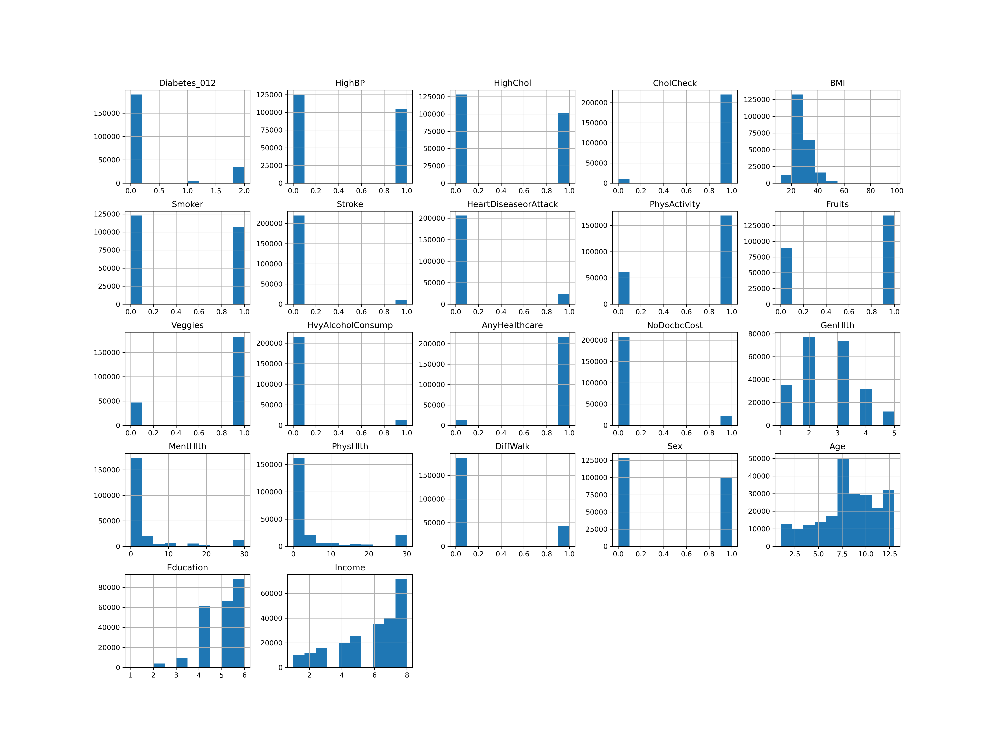

#### Numeric Features
A box plot of the numeric features was created to show the co-relation between the features and the target.

The plot shows the following 

1. Correlation of Body Mass Index(BMI) to diabetes 
   - Respodents with "Pre Diabetes" or "Diabetes" have a high BMI
   - As median BMI increases, the risk of falling into "Pre Diabetes" or "Diabetes" increases
> [!NOTE]
> **High BMI has a strong correlation with the risk of diabetes.**

2. Correlation of mental health to diabetes 
   - Respodents with median days with mental health conditions is close to negligible(almost 0) for all categories
   - Some outliers exist with many people reporting a lot of days when mental health conditions persisted.
> [!NOTE]
> **Mental health does not seem to impact different diabetic categories differently.**

2. Correlation of physical health to diabetes 
   - Respodents with median days of physical health conditions increases in the "Diabetes" category
   - Some outliers exist.
> [!NOTE]
> **Poor physical health shows a weak correlation with the risk of diabetes.**

A Violin plot of the numeric features was created to show correlation between the features and the target.

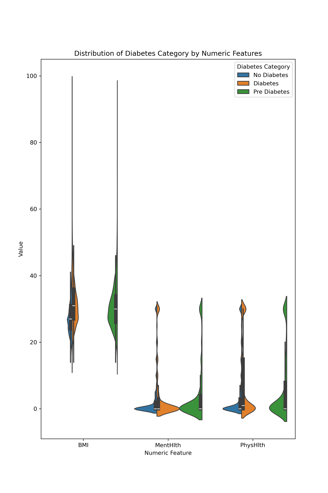

The violin plot  shows that BMI is more differentiated across different diabetic categories. Mental health and Physical health are skewed towards 0 and the differences are hard to visualize(proving the weak or no correlation).

A pair wise grid plot of the numeric features is shown here 

1. **BMI vs Mental Health**: Most data concentrated at MentHlth =0 across all BMIs. Higher BMI seems slighlty more associated with mental health issues.
2. **BMI vs Physical Health**: Positive correlation is visible. Higher BMI seems to associate with greater physical health issues.
3. **Mental Health vs Physical Health**: A stronger grid pattern is observed here. Positive correlation is observed signalling this respodents with poor physical health also have poor mental health. 

##### IQR Analysis
| Feature  	                    | IQR                |    Outlier Percentage|
|----------------------------|-----------------------|---------------------|
| BMI		                    | 8.0                   |  2%                 |
| MentHlth		              | 2.0                   |  15.7%              |
| PhysHlth		              | 4.0                   |  14.9%              |

> [!NOTE]
> **IQR analysis and visual analysis of the box plots show that almost 15% of the respodents experienced 
> worse mental or physical health conditions than the rest of the respodents. However outliers identified here
> should not be removed as they would remove the people identified with chronic conditions, depression and 
> very high BMI and skew the data towards healthy people.**

#### Binary Categorical Clinical Features 

A stacked bar chart of the Clinical Categorical Binary features showed the following 

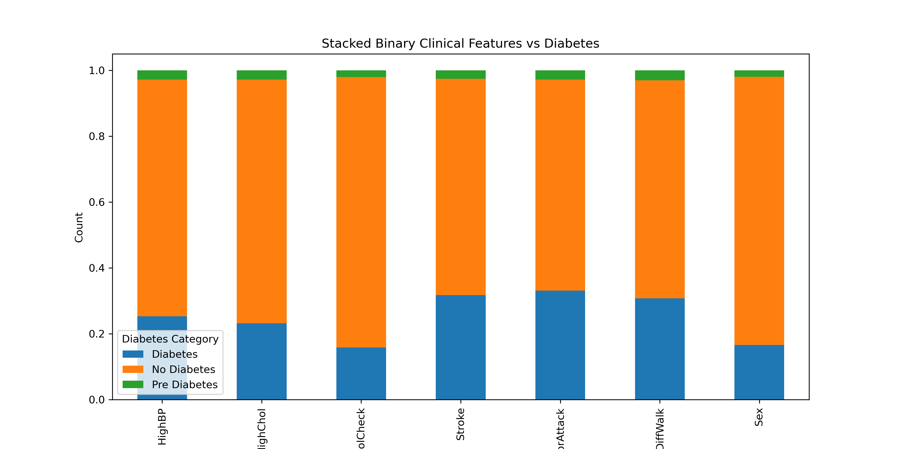

A count plot of the Clinical Categorical Binary features showed the following 

A bar plot of correlation scores of the Clinical Categorical Binary features showed the following

 **Correlation of Clinical Features with risk of diabetes**

| Feature  	   | correlation Score |correlation Indicator|    Note       |
|--------------|-----------------------|---------------|---------------|
| HighBP       |0.254 |Strong Indicator      |Diabetes is more prevalent when high blood pressure is diagnosed. (HighBP=1)|
| HighChol     |0.195 |Strong Indicator      |Diabetes is more prevalent when high cholestrol is diagnosed. (HighChol=1)|
| CholCheck    |0.072| Weak Indicator |Almost everyone had done a cholestrol check in the past 5 years|
| Stroke       |0.099 |Moderate  Indicator   |Low percentage of respodents had a stroke, but within those who had diabetics was a significant number|
| HeartDiseaseorAttack |0.168|Moderate Indicator| More respodents with diabetes have heart disease.|
| DiffWalk |0.206 |Strong Indicator| Respodents who face difficulty walking are more likely to have diabetes.|
| Sex |0.033  |Weak Indicator | Counts are balanced betwen the two genders|

#### Binary Categorical Lifestyle Features 

A stacked bar chart of the Lifestyle Categorical Binary features showed the following 

A count plot of the Lifestyle Categorical Binary features showed the following 

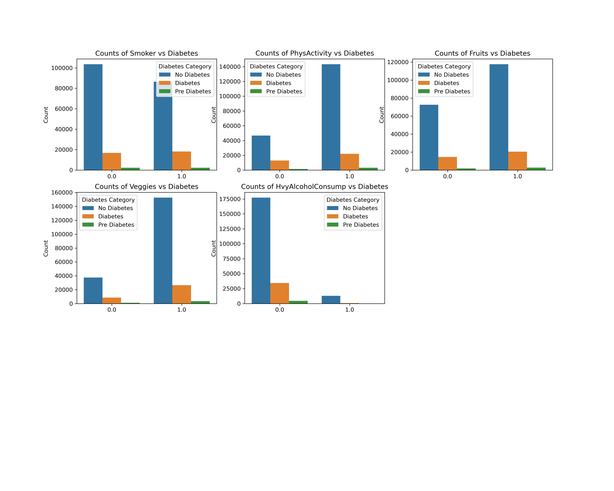

A bar plot of correlation scores of the Lifestyle Categorical Binary features showed the following

**Correlation of Lifestyle Features with risk of diabetes**

| Feature  	   | correlation Score |correlation Indicator|    Note       |
|--------------|-----------------------|---------------|---------------|
| Smoker       |0.046 |Weak Indicator      |Smokers have a slightly higher chance of diabetes|
| PhysActivity     |-0.101  |Strong Indicator      |People doing physical activity have lower risk of diabetes|
| HvyAlcoholConsump    |-0.066 | Moderate Indicator |Heavy consumption of alcohol increase risk of diabetes|
| Veggies       |-0.042  |Weak  Indicator   |Daily Veggie consumption slightly reduces risk of diabetes|
| Fruits       |-0.025  |Weak  Indicator   |Daily fruit consumption slightly reduces risk of diabetes|

#### Categorical Ordinal Features 

The ordinal features have the following characteristics 
| Feature  	   | Cardinality|
|--------------|------------|
|Education     | 6 [Educa USA](https://www.mtusdata.org/mtus-action/variables/EDUCA#codes_section)|
|Income        | 8 [INCOME2](https://www.icpsr.umich.edu/web/RCMD/studies/34085/datasets/0001/variables/INCOME2?archive=RCMD)          |
|Age           | 13 [_AGEG5YR](https://www.cdc.gov/brfss/annual_data/2020/pdf/2020-calculated-variables-version4-508.pdf)         |
|GenHealth     | 5          |

A combined line plot of the Lifestyle Categorical Ordinal features showed the following 

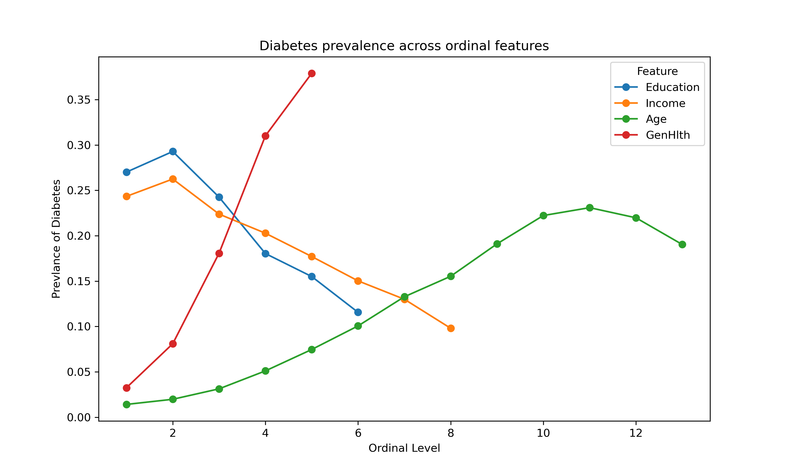

1. **Education**: There is an inverse relationship between the prevalnce of diabetes and education. As education levels increase, diabetes level decreases.This is probably due to the fact that education has a protective effect through increased awareness of the bad effects of diabetes on general health.

2. **Income**: Income also has an inverse relationship with prevalnce of diabetes. As income levels incease, socio economic factors and lifestyle contribute towards a lower prevalence.

3. **Age**: Prevalence of diabetes peaks in middle to late age group. This data matches with general occurence of type 2 diabetes in middle age or older age groups.

4. **GenHealth**: The health score goes from 1 being excellent and 5 being poor. The line plot clearly shows that as the health score increases, the prevalence of diabetes also increases from 3% to almost 38%

# Modeling 

## Baseline Feature selection
Since baseline models are meant to establish a benchmark, we will not drop any features.
We will combine all the features for the initial analysis with the baseline model.

We have also identified that

1. All binary features have 0 or 1 as the values 
2. All ordinal features are valid in range

## Baseline Target selection
For simplicity we have modified the target column from a multiclass problem to a binary one, The target column considered 
is **'Diabetes Prevalence'** which has only 2 possible values

1. 0 - No Diabetes
2. 1 - Diabetes

### Column Transformer

we will create a column transformation pipeline with the following steps 

1. **RobustScaler** for the numerical features.
2. Pass through on the categorical features. (binary and ordinal)

> [!NOTE]
> Since this is health data and we want to preserve the  outliers , we will apply a RobustScaler on the numerical features.

## Baseline Model

1. We will create our baseline with a **Logistic Regression** model for simplicity and easy interpretation
2. Since this is a baseline model , no regularization (L1/L2) was used.

## Train/Test Split
1. Train test split or cross validation is used for reproducibility.
2. 20% of the dataset is used for the testing split.
3. Stratification is used as a cross validation strategy due to the imbalanced nature of the dataset.

## Baseline Model scores 

| Metric  	                 | Score              | Intepretation |
|----------------------------|--------------------|----------------|
| Accuracy                   |  0.851             | 85.1% of the respodents were classified correctly by the model|
| Precision                  |  0.544             | When a model predicts that a respodent has diabetes its right 54.4% of the time| 
| Recall                     |  0.152             | Of all diabetic respodents only 15.2% are identified by the model|
| F1                         |  0.238             | Low recall with moderate precision|
| ROC-AUC                    |  0.811             | Probability that a randomly chosen diabetic respodent is ranked higher in predicted probablity than a randomly chosen non diabetic.|

# Inference 

> [!NOTE]
> **As seen from the distribution Pie chart, the total occurence of diabetes is only 15.3% of the overall
> dataset. The baseline model achieves an accuracy of 85.1% . Since the data is highly imbalanced accuracy cannot be used as a metric.**

> [!NOTE]
> **As seen from the distribution Pie chart, the total occurence of diabetes is only 15.3% of the overall
> dataset. Since the model is precise about half of the time, it shows low precision. In healthcare settings 
> false positives are unacceptable.**

> [!NOTE]
> **Recall is also very low at 15.2% ,again due to imblanced class problem. In the field of healthcare, correctly identifying positive cases is way more important than actual accuracy.**

> [!NOTE]
> **F1 score is also very low at 0.238. This shows that the baseline model performs poorly in 
> balancing false positive and false negatives.** 

> [!NOTE]
> **ROC-AUC is at 0.811. This shows that the baseline model performs reasonably well in 
> ranking diabetics higher than non diabetics and has high discriminative ability.**

## Feature Engineering

## Interaction Features

During exploratory data anyslsis we have seen that some of the Categorical Binary Feature of type Clinical Indicator showed a high degree of correlation with the prevalence of diabetes. Within these features we can look at a subset of features to see , how these features impact diabetes prevalence individually and cumulatively. 

1. Clinical Markers 

Below is the plot showing Diabetes Prevalence by individual clinical markers 

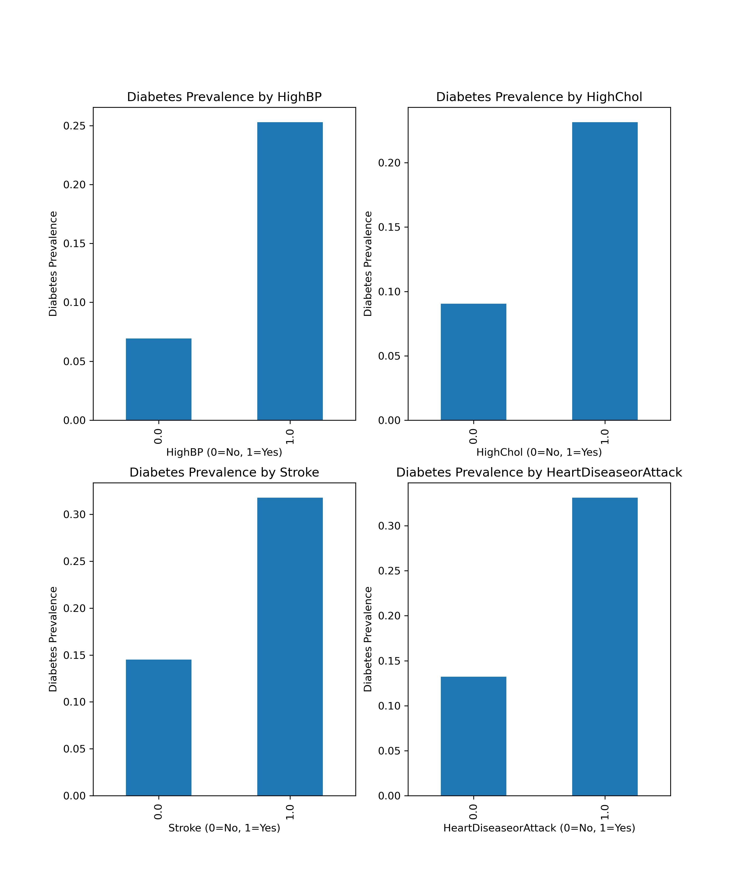

Below is the plot showing Diabetes Prevalence by cumulative clinical markers 

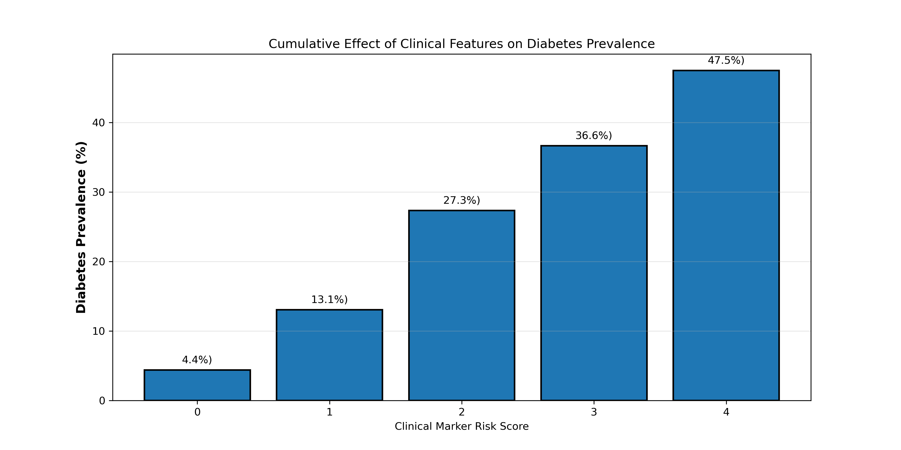

> [!NOTE]
> **As can be seen from the above cumulative plot, the presence of comorbidity indicates severe dysfunction and higher risk of diabetes. We will create a cumulative column for clinical markers.**

2. Lifestye Markers 
   The correlation plot of lifestyle features has already indicated positive or negative correlation with 
   the prevalence of diabetes. We will similarly create a cumulative column for lifestyle markers.
    

3. Both Age and BMI showed high degree of corelation with diabetes prevalence and were strong indicators. With an increase in age, metabolism reduces and insulin resistance develops, so its important to capture this interaction.

4. BMI showed a high degree of positive correlation and physical activity showed a high degree of negative corelation. Its important to capture this interaction.

| Interactive Feature  	     | Intepretation                              |
|----------------------------|--------------------------------------------|
| Clinical Marker Risk       |  Comorbidity increases risk.               |       
| Lifestyle Marker Risk      |  Positive lifestyle traits decrease and negative ones increase risk.               |
| Age BMI Marker Risk        |  Metabolism decreases with age amd high BMI has a compounded impact.               |
| BMI Sedentary Marker Risk  |    Sedentary lifestyle and high BMI increase risk.             |  

## Model Comparision

We will use the following classifiers with balanced weights and compare their scores.

1. Logistic regression with L2 regularization
2. DecisionTreeClassifier
3. RandomForestClassifier
4. GradientBoostingClassifier
5. SVM
6. Gaussian Naive Bayes

## Model Comparison Results (Sorted by Recall)

| Model                | Accuracy | Precision | Recall   | F1-Score | ROC-AUC  | Training Time (s) |
|----------------------|----------|-----------|----------|----------|----------|-------------------|
| Decision Tree        | 0.708    | 0.309     | **0.761**| 0.440    | 0.797    | 0.38              |
| Logistic Regression  | 0.726    | 0.324     | **0.752**| 0.453    | 0.810    | 12.27             |
| SVM (5% sample)      | 0.646    | 0.263     | **0.745**| 0.388    | 0.756    | 23.19             |
| Naive Bayes          | 0.755    | 0.331     | **0.612**| 0.430    | 0.779    | 0.06              |
| Gradient Boosting    | 0.854    | 0.562     | 0.158    | 0.246    | 0.815    | 11.29             |
| Random Forest        | 0.843    | 0.441     | 0.152    | 0.226    | 0.772    | 55.45             |

The following plot show a graphical representation of the training time by model type
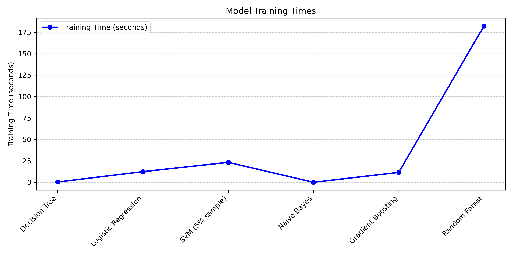

The following plot show a graphical representation of the performance metrics by model type
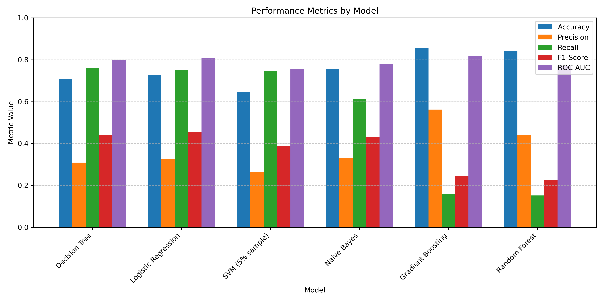

> [!NOTE]
> **SVM is trained on 5% of the total dataset and hence the training time is not a true representation.**

On comparing the results of each of the classifiers we observe the following 

| Model               | Strength                 | Weakness | Verdict | Reason |
|---------------------|--------------------------|----------|---------|--------|
| Decision Tree       | High Recall, Fast        | Precision is Low |   Reccomended      | High Recall is important in healthcare usecase.       |
| Logistic Regression | High recall, decent AUC  |  Precision is Low | Alternative        |  Simple model     |
| SVM (5% sample)     | High recall              |  Low accuracy and slow        |     Not Reccomended    | Impractical training time with no performance benefit over simpler models       |
| Naive Bayes         | Fast and balanced      |  Moderate recall       | Not Reccomended  |  Unacceptable miss rate for medical screening despite speed advantage      |
| Gradient Boosting   | High precision, high accuracy, good ROC-AUC |  Very low recall       |  Not Reccomended        | Optimized for majority class and not useful for healthcare       |
| Random Forest       |  High precision                        |  Very low recall and slow        | Not Reccomended        |  Unacceptable miss rate for medical screening and slow.      |

## Model Tuning

> [!NOTE]
> **We will tune Decision tree, Logistic Regression and Naive Bayes with a Grid Search CV. We will not tune SVM as it will be extremly slow. We will also not tune Gradient Boosting and Random Forest as they have un-usable recall values.**

## Decision Tree Hyperparameter Grid

### Hyperparameter Grid for Decision Tree

| Parameter              | Values Tested                                    |
|------------------------|--------------------------------------------------|
| max_depth              | 8, 10, 12, 15, None                              |
| min_samples_split      | 10, 20, 30, 50                                   |
| min_samples_leaf       | 5, 10, 15, 20                                    |
| class_weight           | balanced, {0: 1, 1: 8}, {0: 1, 1: 10}            |
| criterion              | gini, entropy                                    |

### Hyperparameter Grid for Logistic Regression 

| Parameter              | Values Tested                                    |
|------------------------|--------------------------------------------------|
| C                      | 0.001, 0.01, 0.1, 1, 10, 100                     |
| penalty                | l1, l2                                           |
| solver                 | saga                                             |
| class_weight           | balanced, {0: 1, 1: 8}, {0: 1, 1: 10}            |
| max_iter               | 2000, 3000                                       |

## Tuned Model Performance Comparison

| Model                      | Accuracy | Precision | Recall   | F1-Score | ROC-AUC  | Training Time (s) |
|----------------------------|----------|-----------|----------|----------|----------|-------------------|
| Tuned Decision Tree        | 0.592    | 0.256     | **0.890**| 0.397    | 0.805    | 147.02            |
| Tuned Logistic Regression  | 0.620    | 0.268     | **0.875**| 0.410    | 0.810    | 1442.01           |

## Best Hyperparameters

### Tuned Decision Tree
| Parameter              | Best Value      |
|------------------------|-----------------|
| class_weight           | {0: 1, 1: 10}   |
| criterion              | entropy         |
| max_depth              | 8               |
| min_samples_leaf       | 20              |
| min_samples_split      | 50              |

**Training Time**: 2.45 minutes

### Tuned Logistic Regression
| Parameter              | Best Value      |
|------------------------|-----------------|
| C                      | 1               |
| class_weight           | {0: 1, 1: 10}   |
| max_iter               | 5000            |
| penalty                | l2              |
| solver                 | liblinear       |

**Training Time**: 24.03 minutes

## Key Findings

> [!NOTE]
> **Both tuned models achieved excellent recall (87-89%)** - a significant improvement over baseline models (76% recall). This means they now identify nearly 9 out of 10 diabetic patients.

> [!IMPORTANT]
> **Trade-offs:**
> - **Recall improved**: 76% → 89% (Decision Tree baseline to tuned)
> - **Precision decreased**: 31% → 26% (more false positives)

## Feature Importance - Tuned Decision Tree

| Rank | Feature                  | Importance | Category            | Interpretation |
|------|--------------------------|------------|---------------------|----------------|
| 1    | ClinicalMarkerRisk       | 0.4067     | Engineered Feature  | Cumulative clinical risk score (comorbidities) |
| 2    | GenHlth                  | 0.2382     | Lifestyle (Ordinal) | Self-reported general health (1=excellent, 5=poor) |
| 3    | AgeBMIMarkerRisk         | 0.2353     | Engineered Feature  | Age × BMI interaction |
| 4    | BMI                      | 0.0622     | Numeric             | Body Mass Index |
| 5    | CholCheck                | 0.0102     | Clinical (Binary)   | Cholesterol check in past 5 years |
| 6    | HvyAlcoholConsump        | 0.0081     | Lifestyle (Binary)  | Heavy alcohol consumption |
| 7    | Sex                      | 0.0054     | Clinical (Binary)   | Gender |
| 8    | MentHlth                 | 0.0054     | Lifestyle (Numeric) | Days of poor mental health (past 30 days) |
| 9    | Income                   | 0.0048     | Lifestyle (Ordinal) | Income level |
| 10   | HighBP                   | 0.0044     | Clinical (Binary)   | High blood pressure |
| 11   | DiffWalk                 | 0.0040     | Clinical (Binary)   | Difficulty walking/climbing stairs |
| 12   | PhysHlth                 | 0.0033     | Lifestyle (Numeric) | Days of poor physical health (past 30 days) |
| 13   | Education                | 0.0031     | Lifestyle (Ordinal) | Education level |
| 14   | HighChol                 | 0.0019     | Clinical (Binary)   | High cholesterol |
| 15   | Age                      | 0.0016     | Clinical (Ordinal)  | Age category |

The following plot shows the feature importance as determined by the DecisionTreeClassifier. 
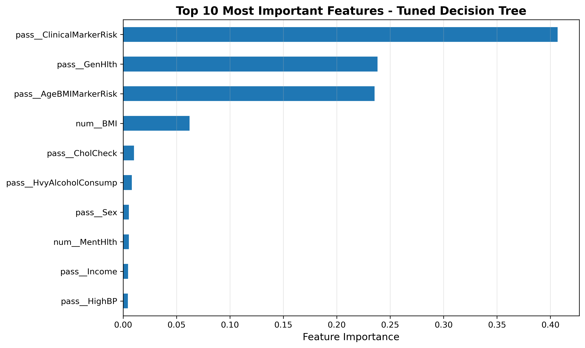

## Training Neural Networks 

### Simple Architecture 

| Layer | Type | Units/Shape | Activation | Parameters | Purpose |
|-------|------|-------------|------------|------------|---------|
| Input | Input | (21,) | - | 0 | Accepts 21 features (original features, no engineered) |
| Hidden 1 | Dense | 64 | ReLU | 1,408 | First hidden layer for feature learning |
| Hidden 2 | Dense | 32 | ReLU | 2,080 | Second hidden layer for pattern extraction |
| Output | Dense | 1 | Sigmoid | 33 | Binary classification output (diabetes probability) |

### Neural Network Performance Metrics

| Metric | Score | Interpretation |
|--------|-------|----------------|
| Accuracy | 0.739 | 73.9% of all predictions were correct |
| Precision | 0.333 | When model predicts diabetes, it's correct 33.3% of the time |
| Recall | **0.709** | Model identifies **70.9%** of diabetic patients |
| F1-Score | 0.453 | Harmonic mean of precision and recall |
| ROC-AUC | 0.802 | Model's ability to distinguish between classes |
| Training Time | 0.91 min | Model trained in under 1 minute |

**Recall Over Training** 

1. Training recall starts at 80% and increases to 82%, showing that the model is learning.
2. Validation recall fluctuates (0.71–0.80).

**Loss Over Training**
1. Training loss decreases from 93% to 86% showing optimization.

### Advanced Architecture

| Layer | Type | Units/Shape | Activation | Regularization | Parameters | Purpose |
|-------|------|-------------|------------|----------------|------------|---------|
| Input | Input | (21,) | - | - | 0 | Accepts 21 original features |
| Hidden 1 | Dense | 256 | ReLU | L2 (0.01) | 5,632 | Wide entry layer for initial feature learning |
| Hidden 2 | Dense | 128 | ReLU | L2 (0.01) | 32,896 | Intermediate pattern extraction |
| Hidden 3 | Dense | 64 | ReLU | L2 (0.01) | 8,256 | Higher-level feature combinations |
| Hidden 4 | Dense | 32 | ReLU | None | 2,080 | Deep pattern recognition |
| Hidden 5 | Dense | 16 | ReLU | None | 528 | Bottleneck layer before output |
| Output | Dense | 1 | Sigmoid | None | 17 | Binary diabetes probability [0,1] |

### Neural Network Performance Metrics

| Metric | Score | Interpretation |
|--------|-------|----------------|
| Accuracy | 0.687 | 68.7% of all predictions were correct |
| Precision | 0.305 | When model predicts diabetes, it's correct 30.5% of the time |
| **Recall** | **0.819** | Model identifies **81.9%** of diabetic patients |
| F1-Score | 0.444 | Harmonic mean of precision and recall |
| ROC-AUC | 0.819 | Model's ability to distinguish between classes |
| Training Time | 1.55 min | Model trained in ~90 seconds |

**Recall Over Training**

1. Training recall completely flat at ~81% for all 100 epochs.
2. Validation recall fluctuates between 75-86% (±6%).
3. Zero Learning After Initialization

**Loss Over Training**
1. Training loss decreases flat at 93% showing no optimization.
2. L2 penalty didn't help convergence

The image below shows how the neural network performs
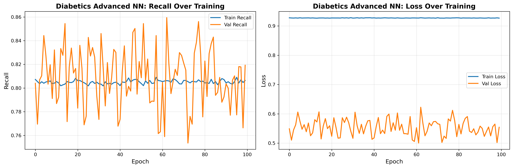

> [!IMPORTANT]
>  After multiple attempts with 
>  1. 2 layer and 5 layer architecture
>  2. L2 and No regularization
>  3. Class weights
>  4. Fixed and random validation weights
> **We see inconsistent 71-81% recall with Neural Networks vs consistent recall of 89% with DecisionTree and 87.5% with LogisticRegression.**
